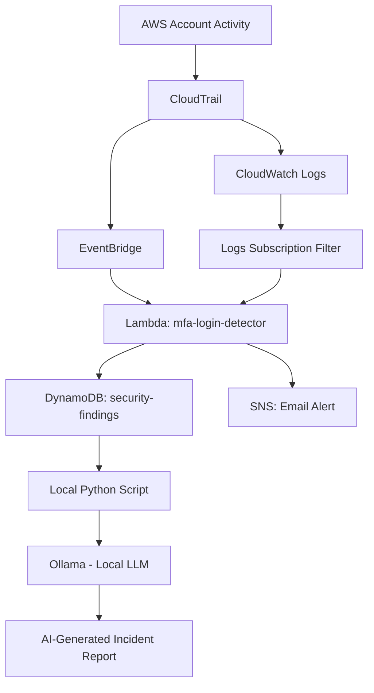
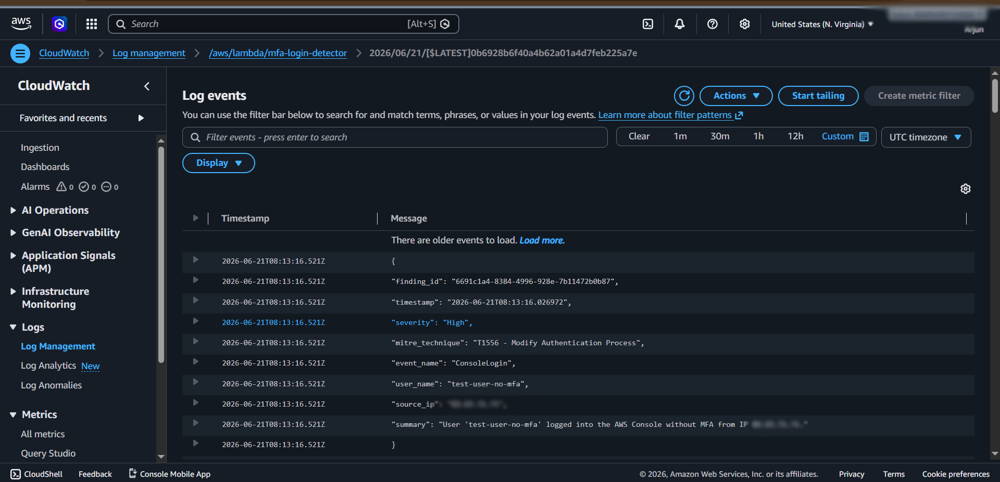
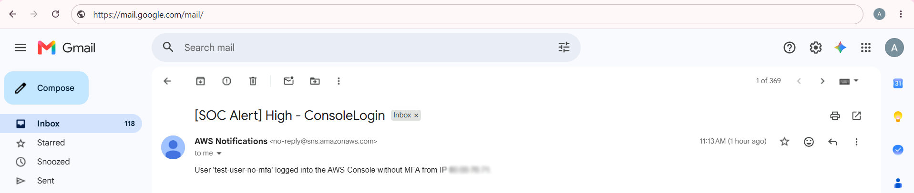
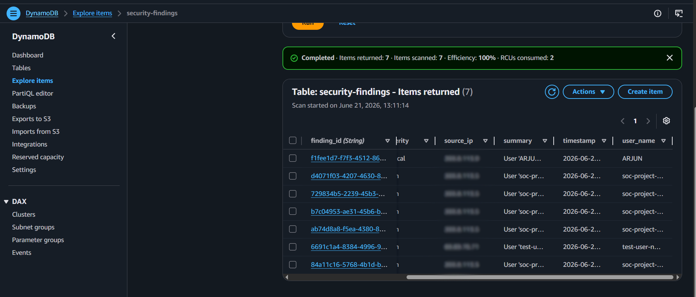
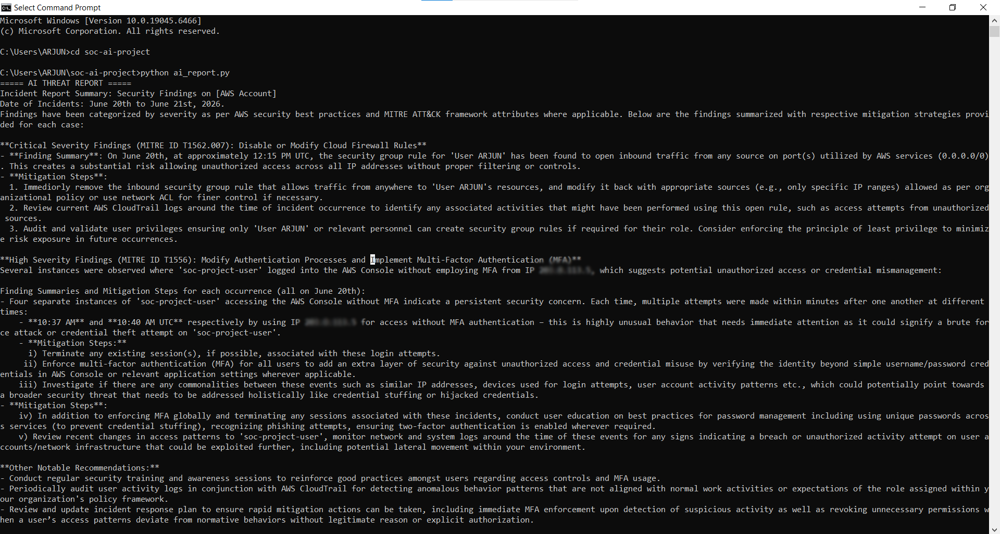

# AI-Powered AWS Threat Detection Pipeline

A lightweight, zero-cost recreation of AWS GuardDuty-style threat detection, built using only free-tier AWS services and a local AI model for analyst-style incident reporting.

## Why This Project Exists

AWS GuardDuty is a managed threat detection service — but it's only free for a 30-day trial, after which it bills per GB of data analyzed. Rather than pay for it, this project demonstrates the same underlying detection mechanics by building them from scratch using AWS's permanently free-tier services, plus a local large language model (via Ollama) to generate human-readable incident reports, the kind a SOC Tier 1 analyst would write for a shift handoff.

This project is not intended to replace GuardDuty in a production environment. It exists to demonstrate a working understanding of how managed cloud threat detection actually works under the hood.

## Architecture

Two separate AWS-native delivery paths feed the same Lambda function, because of a real limitation discovered during development (see **Lessons Learned** below).

## Detections Implemented

| Detection | Trigger Path | MITRE ATT&CK Technique | Severity |
|---|---|---|---|
| Console login without MFA | CloudTrail → CloudWatch Logs → Subscription Filter → Lambda | T1556 — Modify Authentication Process | High |
| Security group opened to 0.0.0.0/0 | CloudTrail → EventBridge → Lambda | T1562.007 — Impair Defenses: Disable or Modify Cloud Firewall | Critical |

## Tech Stack

- **AWS CloudTrail** — account activity logging (always free)
- **AWS EventBridge** — real-time event routing for supported event types (always free)
- **AWS CloudWatch Logs + Subscription Filters** — alternate delivery path for event types not supported by EventBridge (always free tier)
- **AWS Lambda** — detection logic, severity scoring, MITRE mapping (always free tier)
- **AWS DynamoDB** — persistent findings storage (always free tier)
- **AWS SNS** — real-time email alerting (always free tier)
- **Ollama (local)** — runs an open-weight LLM (phi3) entirely on-device, no API cost
- **Python + boto3** — local script to pull findings and generate AI incident reports

**Total cost: $0/month**, using only AWS's permanently free-tier services (not 12-month trial limits).

## Repository Contents

- `lambda_function.py` — the detection logic deployed to AWS Lambda
- `ai_report.py` — local script that pulls findings from DynamoDB and generates a readable incident report via Ollama
- `incident-response-runbook.md` — documented response procedures for each detection
- `threat_report.txt` — sample AI-generated output

## How It Works

1. A risky action occurs in the AWS account (e.g., a no-MFA login or an overly permissive firewall rule)
2. CloudTrail logs the event automatically
3. Depending on event type, it's delivered to Lambda either via EventBridge or via a CloudWatch Logs Subscription Filter
4. Lambda parses the event, scores severity, and maps it to a MITRE ATT&CK technique
5. The finding is saved to DynamoDB and an email alert is sent via SNS
6. A local script periodically pulls all findings and asks a local LLM to generate a structured, human-readable incident report

## Demo: A Real Alert in Action

The sequence below shows an actual detection firing end-to-end — from the triggering event being logged, through to the AI-generated incident report.

**1. The detection fires automatically (CloudWatch Logs showing the parsed finding):**

**2. An email alert is sent in real time via SNS:**

**3. The finding is permanently stored in DynamoDB:**

**4. A local AI model generates a human-readable incident report from the stored findings:**

## Lessons Learned

During development, the no-MFA login detection was originally built using EventBridge — the same mechanism used for the security group detection. After extensive testing (including a maximally broad catch-all event pattern matching every event in the account), it became clear that **AWS does not deliver Console Sign-In events through the default EventBridge event bus**, regardless of configuration. This was confirmed by checking CloudTrail Event History directly, verifying the EventBridge rule's configuration and target permissions, and observing zero `MatchedEvents` even under a catch-all pattern.

The fix was to switch that specific detection to a different, equally valid AWS-native delivery method: a CloudTrail Trail delivering logs to CloudWatch Logs, with a Subscription Filter triggering Lambda directly. This required restructuring the Lambda function to handle two different incoming event formats (EventBridge's `detail` structure vs. CloudWatch Logs' base64/gzip-encoded `awslogs` payload) in a single function.

This troubleshooting process — methodically isolating the failure point across CloudTrail, EventBridge, IAM permissions, and Lambda logs is, if anything, a stronger demonstration of real-world cloud security skills than if the original approach had worked on the first try.

## Future Improvements

- Additional detections mapped to other common MITRE ATT&CK Cloud Matrix techniques (e.g., T1078 Valid Accounts, T1098 Account Manipulation)
- A lightweight dashboard (e.g., Streamlit) for visualizing findings instead of viewing them directly in DynamoDB
- Scheduled automatic generation of AI incident reports (e.g., via Windows Task Scheduler or a cron job)
- Least-privilege IAM policy refinement (current implementation uses broader managed policies for simplicity during development)

## Author

Built by Arjun as a hands-on portfolio project while preparing for a SOC Analyst role, focused on understanding cloud threat detection mechanics rather than relying on managed/paid tooling.
